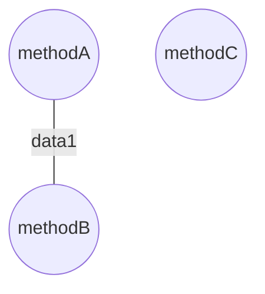

# TCC *vs* LCC

Explain under which circumstances *Tight Class Cohesion* (TCC) and *Loose Class Cohesion* (LCC) metrics produce the same value for a given Java class. Build an example of such as class and include the code below or find one example in an open-source project from Github and include the link to the class below. Could LCC be lower than TCC for any given class? Explain.

A refresher on TCC and LCC is available in the [course notes](https://oscarlvp.github.io/vandv-classes/#cohesion-graph).

## Answer

I found 3 cases where TCC = LCC. 
- If a class has only one method, both TCC and LCC will be 1.0 because there is only one method, and there are no other methods to relate to or be independent of.
- If a class has no methods (only attributs), both TCC and LCC will be 0, as there are no methods to measure cohesion.
- If the graph that results from the class is equal to is Transitive closure.


```java
public class EqualCohesionClass {
    private int data1;
    private int data2

    public void methodA() {
        data1 = data1 + 1;
    }

    public void methodB() {
        data1 = data1 - 1;
    }

    public void methodC() {
        data2 = data2 + 1;
    }
}
```


TCC = 1/3
LCC = 1/3

LCC can't be lower than TCC because the number of edges in classic graph can't be higher than his transitive closure.
